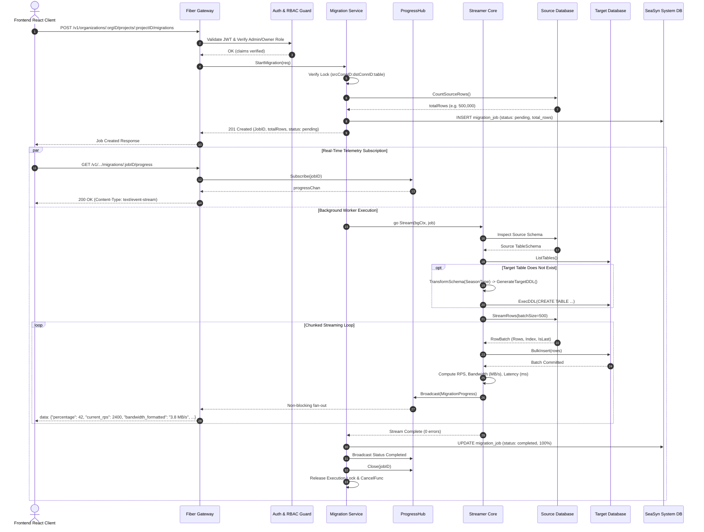

# 📚 SeaSyn Technical Architecture & System Documentation Portal

[](README.md)
[](../backend/README.md)
[](../backend)
[](../frontend)
[](http://localhost:8080/swagger/index.html)

Welcome to the **SeaSyn Technical Documentation Portal**. This repository of technical specifications, system design blueprints, and operational runbooks documents the internal mechanics of SeaSyn—a cloud-native, high-throughput database migration, schema synchronization, and live telemetry platform.

---

## 📑 Table of Contents

1. [High-Level System Design (HLD)](#-high-level-system-design-hld)
   - [7-Tier Layered Architecture Blueprint](#1-7-tier-layered-architecture-blueprint)
   - [End-to-End Migration Sequence Flow](#2-end-to-end-migration-sequence-flow)
2. [Migration Engine Technical Specification](#-migration-engine-technical-specification)
   - [Bounded Channel Pipeline & Memory Isolation](#1-bounded-channel-pipeline--memory-isolation)
   - [Universal Type System (`SeasonType`) & Auto-DDL](#2-universal-type-system-seasontype--auto-ddl)
   - [Real-Time Physics Telemetry & SSE Pub/Sub Broker](#3-real-time-physics-telemetry--sse-pubsub-broker)
   - [Concurrency Collision Guard & Cooperative Cancellation](#4-concurrency-collision-guard--cooperative-cancellation)
3. [Heterogeneous Database Adapter Matrix](#-heterogeneous-database-adapter-matrix)
4. [Frontend Reactive Architecture & Telemetry Visualizer](#-frontend-reactive-architecture--telemetry-visualizer)
5. [Security, Cryptography & Multi-Tenancy](#-security-cryptography--multi-tenancy)
6. [Webhooks & Audit Trail Specifications](#-webhooks--audit-trail-specifications)
7. [API Catalog & Swagger OpenAPI 3.0 Guide](#-api-catalog--swagger-openapi-30-guide)
8. [Documentation Directory Index](#-documentation-directory-index)
9. [Operational Runbook & CI/CD Verification](#-operational-runbook--cicd-verification)

---

## 🏛 High-Level System Design (HLD)

### 1. 7-Tier Layered Architecture Blueprint

The platform architecture is divided into seven decoupled tiers to guarantee zero-OOM execution, driver agnosticism, and multi-tenant security:

```mermaid
flowchart TB
    %% ==========================================
    %% CLIENT & PRESENTATION LAYER
    %% ==========================================
    subgraph ClientLayer ["1. Client & Presentation Layer (Migration Studio)"]
        UI_Studio["Frontend UI: Migration Studio & Analytics Dashboard"]
        UI_Wizard["Migration Launch Modal<br/>(Source, Target, Table, BatchSize)"]
        UI_Chart["Live Telemetry Charts<br/>(Moving RPS, Bandwidth MB/s, Latency ms)"]
        UI_SSE["SSE Client (EventSource)<br/>/v1/.../migrations/:id/progress"]
    end

    %% ==========================================
    %% API & SECURITY GATEWAY
    %% ==========================================
    subgraph GatewayLayer ["2. API & Security Gateway (Fiber v2 HTTP)"]
        GW_Router["Fiber Engine & URL Router"]
        GW_Auth["JWT Authentication Middleware<br/>(Extracts & Validates User Claims)"]
        GW_RBAC["RBAC & Tenant Guard<br/>(Requires Admin/Owner Role)"]
        GW_Val["Request DTO Validation<br/>(UUIDs, Identifier Sanitization)"]
        GW_SSE_Hdlr["SSE Streaming Handler<br/>(Chunked Transfer & Keepalive)"]
    end

    %% ==========================================
    %% CONTROL PLANE & ORCHESTRATION
    %% ==========================================
    subgraph ControlPlane ["3. Orchestration & Control Plane (Migration Service)"]
        JobService["Migration Service<br/>(Lifecycle Coordinator)"]
        ExecLock["Concurrent Execution Lock<br/>(sync.Map: srcConn:dstConn:table)"]
        CancelRegistry["Cancellation Controller<br/>(sync.Map: jobID -> context.CancelFunc)"]
        StateEngine["Job State Coordinator<br/>(Pending -> Running -> Completed/Failed)"]
        AuditEmitter["Audit Log Service<br/>(migration.started/completed/failed)"]
        WebhookEmitter["Webhook Dispatcher<br/>(Async HTTP Dispatch to Integrations)"]
    end

    %% ==========================================
    %% STREAMING PIPELINE & EXECUTION CORE
    %% ==========================================
    subgraph ExecutionCore ["4. Streaming Pipeline Core (Streamer)"]
        Streamer["Streamer Engine"]
        CryptoEngine["Credential Decryptor<br/>(AES-GCM Decryption of URI & Passwords)"]
        Preflight["Pre-flight Inspector<br/>(Source Row Count & Target Check)"]
        SchemaTransformer["Canonical Schema Transformer<br/>(Source Types -> SeasonType -> Target Types)"]
        DDLEngine["Auto-DDL Synthesizer<br/>(Generates & Applies Missing CREATE TABLE)"]
        RowChannel["Buffered Row Batch Channel<br/>(chan domain.RowBatch, cap=4)"]
        ErrChannel["Error Channel<br/>(chan error, cap=1)"]
        MetricsComputer["Telemetry Computer<br/>(Computes RPS, Bandwidth, Batch Latency)"]
    end

    %% ==========================================
    %% REAL-TIME TELEMETRY FAN-OUT
    %% ==========================================
    subgraph TelemetryHub ["5. Real-Time Telemetry Broker (ProgressHub)"]
        Hub["ProgressHub (In-Memory Pub/Sub)"]
        SubRegistry["Subscriber Map (sync.RWMutex)<br/>map[jobID][]chan MigrationProgress"]
        Broadcaster["Non-Blocking Broadcaster<br/>(Drops Slow Clients to Avoid Pipeline Pauses)"]
    end

    %% ==========================================
    %% HETEROGENEOUS ADAPTER LAYER
    %% ==========================================
    subgraph AdapterLayer ["6. Heterogeneous Driver Adapters (Hexagonal Ports)"]
        Registry["Adapter Registry (Engine Factory)"]
        PGAdapter["PostgreSQL Adapter (pgx/v5)<br/>StreamRows: ORDER BY ctid<br/>BulkInsert: Multi-row parameterized"]
        MySQLAdapter["MySQL Adapter (go-sql-driver)<br/>StreamRows: Keyset/Offset paging<br/>BulkInsert: Multi-value INSERT"]
        MongoAdapter["MongoDB Adapter (mongo-driver)<br/>StreamRows: Cursor batching<br/>BulkInsert: InsertMany (BSON)"]
        SQLiteAdapter["SQLite Adapter (modernc)<br/>StreamRows: Fast local cursor<br/>BulkInsert: Transaction batch"]
    end

    %% ==========================================
    %% STORAGE & INFRASTRUCTURE
    %% ==========================================
    subgraph StorageLayer ["7. Storage & Infrastructure Layer"]
        SystemDB["SeaSyn Core DB (PostgreSQL)<br/>migration_jobs, audit_logs, users"]
        SourceDB["Source Database<br/>(Postgres, MySQL, Mongo, SQLite)"]
        TargetDB["Target Database<br/>(Postgres, MySQL, Mongo, SQLite)"]
    end

    UI_Wizard -->|"POST /v1/.../migrations"| GW_Router
    UI_SSE -->|"GET /v1/.../migrations/:id/progress"| GW_Router
    GW_Router --> GW_Auth --> GW_RBAC --> GW_Val
    GW_Val -->|"StartMigration()"| JobService
    GW_Router -->|"CancelMigration()"| JobService
    GW_Router -->|"ProgressStream()"| GW_SSE_Hdlr
    GW_SSE_Hdlr <-->|"Subscribe / Read"| Hub

    JobService -->|"Verify & Acquire Lock"| ExecLock
    JobService -->|"Register context.CancelFunc"| CancelRegistry
    JobService -->|"Create & Update Job Record"| SystemDB
    JobService -->|"Emit Event"| AuditEmitter
    JobService -->|"Dispatch Hook"| WebhookEmitter
    JobService -->|"Launch Goroutine"| Streamer

    Streamer -->|"Decrypt Passwords & URIs"| CryptoEngine
    Streamer -->|"Resolve Driver Adapters"| Registry
    Registry --> PGAdapter
    Registry --> MySQLAdapter
    Registry --> MongoAdapter
    Registry --> SQLiteAdapter

    Streamer -->|"1. Count Rows & Check Target"| Preflight
    Preflight --> SourceDB
    Streamer -->|"2. Schema Diff & Auto-Provision"| SchemaTransformer
    SchemaTransformer --> DDLEngine
    DDLEngine -->|"Execute CREATE TABLE if needed"| TargetDB

    Streamer -->|"3. Open StreamRows()"| SourceDB
    SourceDB -.->|"Chunked Batches"| RowChannel
    SourceDB -.->|"Read Errors"| ErrChannel

    RowChannel -->|"4. Consume Batch"| Streamer
    Streamer -->|"5. BulkInsert(rows)"| TargetDB
    Streamer -->|"6. Calculate Velocity & Latency"| MetricsComputer
    MetricsComputer -->|"7. Broadcast(Progress)"| Hub

    Hub --> Broadcaster
    Broadcaster --> SubRegistry
    SubRegistry -->|"Push Event Payload"| GW_SSE_Hdlr
    GW_SSE_Hdlr -->|"SSE Stream: data: {...}"| UI_Chart
```



---

### 2. End-to-End Migration Sequence Flow



---

## ⚙️ Migration Engine Technical Specification

### 1. Bounded Channel Pipeline & Memory Isolation

A major engineering challenge in database migrations is unbounded memory consumption when reading millions of records into RAM. SeaSyn solves this using an asynchronous producer-consumer channel pipeline with strict capacity bounds:

```go
// StreamRows initializes a bounded channel pipeline
rowCh := make(chan domain.RowBatch, 4)
errCh := make(chan error, 1)
```

1. **Producer Goroutine (Source Reader)**: Pulls chunked batches (`LIMIT $1 OFFSET $2` or cursor-based) from the source database driver and emits `domain.RowBatch` structures onto `rowCh`.
2. **Bounded Buffer Limit (`cap=4`)**: At most 4 batches exist in memory simultaneously (e.g., $4 \times 500 = 2,000$ rows $\approx 1.5\text{ MB}$ payload).
3. **Automatic Backpressure**: If the target database experiences write latency or slow network commits, the channel fill buffer blocks the producer goroutine automatically. Memory footprint remains strictly bounded ($<64\text{ MB}$) regardless of dataset size.

---

### 2. Universal Type System (`SeasonType`) & Auto-DDL

Databases enforce incompatible type systems. SeaSyn defines an intermediate canonical type layer (`SeasonType`) to normalize source schemas before synthesizing target DDL:

<p align="center">
  
</p>

#### Canonical Type Mapping Matrix

| `SeasonType` | PostgreSQL (`pgx`) | MySQL (`go-sql-driver`) | MongoDB (`mongo-driver`) | SQLite (`modernc`) |
|---|---|---|---|---|
| `SeasonTypeInt` | `BIGINT` | `BIGINT` | `int` / `long` | `INTEGER` |
| `SeasonTypeString` | `TEXT` | `TEXT` | `string` | `TEXT` |
| `SeasonTypeBool` | `BOOLEAN` | `TINYINT(1)` | `bool` | `INTEGER` |
| `SeasonTypeTimestamp` | `TIMESTAMPTZ` | `DATETIME(6)` | `date` | `TEXT` |
| `SeasonTypeJSON` | `JSONB` | `JSON` | `object` | `TEXT` |
| `SeasonTypeFloat` | `DOUBLE PRECISION` | `DOUBLE` | `double` | `REAL` |
| `SeasonTypeDecimal` | `NUMERIC` | `DECIMAL(38,18)` | `decimal` | `NUMERIC` |
| `SeasonTypeBinary` | `BYTEA` | `LONGBLOB` | `binData` | `BLOB` |
| `SeasonTypeUUID` | `UUID` | `CHAR(36)` | `string` | `TEXT` |

#### Auto-DDL Pipeline
If a migration targets a relational engine and the destination table does not exist:
1. `GetTableSchema(ctx, sourceTable)` inspects column names, nullability, and primary keys.
2. `TransformSchema(srcSchema, srcDB, dstDB)` maps types into `SeasonType` and outputs a `TransformedSchema`.
3. `GenerateTargetDDL(transformed)` synthesizes target-dialect DDL (e.g. `CREATE TABLE "users" ("id" UUID PRIMARY KEY, ...)`).
4. `ExecDDL(ctx, ddl)` provisions the destination table schema before the first batch is written.

---

### 3. Real-Time Physics Telemetry & SSE Pub/Sub Broker

During active streaming, `Streamer` profiles execution physics on every batch commit:

$$\text{Current RPS (Velocity)} = \frac{|\text{batch.Rows}|}{\Delta t}$$

$$\text{Bandwidth (Bytes/sec)} = \frac{\text{estimateBatchBytes}(\text{batch.Rows})}{\Delta t}$$

$$\text{Progress (\%)} = \min\left(100.0, \frac{\text{Migrated Rows}}{\text{Total Rows}} \times 100\right)$$

#### Telemetry Event Schema (`/v1/.../migrations/:jobID/progress`)
```json
{
  "job_id": "4b68e998-90b9-4a0b-8bf1-2292f703e4dc",
  "state": "running",
  "migrated_rows": 145000,
  "total_rows": 500000,
  "percentage": 29.0,
  "message": "Batch 290 processed (500 rows)",
  "timestamp": "2026-09-29T10:45:00.123Z",
  "current_rps": 2840.5,
  "bandwidth_bytes_per_sec": 4125820.0,
  "bandwidth_formatted": "3.9 MB/s",
  "bytes_transferred": 119648780,
  "bytes_transferred_formatted": "114.1 MB",
  "batch_index": 290,
  "batch_latency_ms": 176
}
```

#### Non-Blocking Pub/Sub Fan-Out (`ProgressHub`)
- Thread-safe subscriber map: `map[string][]chan domain.MigrationProgress` guarded by `sync.RWMutex`.
- Non-blocking channel write: `select { case ch <- event: default: /* drop frame if client queue full */ }`. Slow network connections never throttle the database ingestion pipeline.

---

### 4. Concurrency Collision Guard & Cooperative Cancellation

1. **Collision Mutex**: Uses a thread-safe `sync.Map` with key `fmt.Sprintf("%s:%s:%s", srcConnID, dstConnID, table)`. Attempting to start a concurrent job on the same dataset immediately returns `409 Conflict (MIGRATION_ALREADY_RUNNING)`.
2. **Cooperative Cancellation**: Every migration launches with `context.WithCancel(context.Background())`, registering the cancel function in `cancelFuncs sync.Map`. Calling `DELETE /migrations/:jobID` cancels the context. The reader and writer loops check `ctx.Done()` at each batch boundary, safely aborting execution and marking the job `cancelled`.

---

## 🔌 Heterogeneous Database Adapter Matrix

SeaSyn utilizes a **Hexagonal Adapter Registry** (`ports.AdapterRegistry`). Drivers satisfy the `ports.DatabaseConnection` interface:

| Engine | Driver Library | Batch Read Mechanism | Bulk Ingestion Strategy | DDL & Constraints |
|---|---|---|---|---|
| **PostgreSQL** | `github.com/jackc/pgx/v5` | `ORDER BY ctid LIMIT $1 OFFSET $2` | Multi-row parameterized SQL: `INSERT INTO table (c1, c2) VALUES ($1, $2), ...` | Native Postgres DDL |
| **MySQL** | `github.com/go-sql-driver/mysql` | Keyset pagination / `LIMIT ? OFFSET ?` | Multi-value SQL: `INSERT INTO table (c1, c2) VALUES (?, ?), ...` | Native MySQL DDL |
| **MongoDB** | `go.mongodb.org/mongo-driver` | Cursor-based chunked collection scan | `collection.InsertMany(ctx, docs)` with BSON maps | JSON Schema Validator |
| **SQLite** | `modernc.org/sqlite` (Pure Go) | Fast local sequential cursor | Single-transaction parameterized bulk insert | SQLite `CREATE TABLE` |

---

## 🎨 Frontend Reactive Architecture & Telemetry Visualizer

The frontend is built with **React 19**, **Vite 7**, and **Tailwind CSS v4** to deliver an interactive engineering dashboard:

```
frontend/src/
├── api/                            # Axios HTTP client with automatic 401 refresh interception
├── components/
│   ├── dashboard/                  # Organization & Project analytics cards
│   ├── migration/                  # Migration Studio, Wizard modal, and Live Moving Telemetry charts
│   ├── schema/                     # Schema diff visualizer and Table Data Explorer
│   └── ui/                         # Base UI components styled with Tailwind CSS v4 & Framer Motion
├── pages/
│   ├── authpages/                  # Login, Signup, OTP Verify, Password Reset views
│   ├── dashboard/                  # Main Overview, Projects, Topology views
│   └── Home.tsx                    # Landing and product introduction view
└── store/                          # Zustand global state (User, Active Tenant, SSE connection pool)
```

- **Reactive SSE Consumer**: Maintains an active `EventSource` connection to `/v1/.../migrations/:id/progress`.
- **Moving Physics Graphs**: High-frequency streaming telemetry renders dynamic velocity ($\text{RPS}$), bandwidth ($\text{MB/s}$), and latency curves with zero page jitter.

---

## 🔒 Security, Cryptography & Multi-Tenancy

### 1. Encryption at Rest & In Transit
- **AES-256-GCM Vault**: Database connection strings, passwords, and private parameters are encrypted using AES-256-GCM with dynamic random nonces before persisting to PostgreSQL.
- **Argon2id Password Hashing**: User authentication hashes credentials using Argon2id with cryptographically secure random salts.

### 2. Dual-Transport Authentication
- **HTTP Bearer Tokens**: Standard `Authorization: Bearer <JWT>` header transport for programmatic API access, Swagger UI, and CLI tools.
- **Secure HttpOnly Cookies**: Sliding window `access_token` and `refresh_token` cookies for browser-based UI navigation.
- **Swagger Security Isolation**: Explicit `Referer` header inspection disables automatic cookie fallback when testing through `/swagger/`, requiring users to authenticate via the Swagger Lock dialog.

### 3. Role-Based Access Control (RBAC)
- 👑 **Owner**: Full administrative control, tenant deletion, billing, role modifications.
- 🛡️ **Admin**: Launch/cancel migrations, add database connections, configure webhooks, view audit logs.
- 👤 **Member**: Inspect schemas, execute read-only queries, view analytics.
- 👁️ **Viewer**: Read-only overview of projects and migration history.

---

## 🔔 Webhooks & Audit Trail Specifications

SeaSyn maintains an immutable audit log of all organizational actions and supports outbound webhook dispatching:

### Outbound Webhook Delivery
- **Cryptographic Signature**: Payload delivery includes the HTTP header `X-Seasyn-Signature: sha256=<HMAC-SHA256>` generated with the webhook secret.
- **Asynchronous Worker Pool**: Dispatches payloads decoupled from HTTP handlers with configurable retry backoff and delivery status logging.
- **Supported Events**:
  - `migration.started`, `migration.completed`, `migration.failed`, `migration.cancelled`
  - `project.created`, `project.deleted`
  - `connection.created`, `connection.deleted`
  - `member.invited`, `member.removed`, `member.role_updated`

---

## 📡 API Catalog & Swagger OpenAPI 3.0 Guide

Interactive OpenAPI documentation is served at **`http://localhost:8080/swagger/index.html`**.

> **Swagger Authentication Instructions**:
> 1. **Basic Auth Prompt**: Enter `SWAGGER_USER` and `SWAGGER_PASS` (defaults: `admin` / `seasyn_docs_2026` or configured in `.env`).
> 2. **Bearer Token Lock**: Authenticated endpoints show the 🔒 **Authorize** lock. Click **Authorize** and input `Bearer <your_access_token>`.

### Summary of RESTful Routes (`/v1`)

| Domain | Method | Endpoint Path | Description | Required Role |
|---|---|---|---|---|
| **Auth** | `POST` | `/v1/auth/signup` | Register user account | Public |
| **Auth** | `POST` | `/v1/auth/login` | Login & receive JWT credentials | Public |
| **Auth** | `POST` | `/v1/auth/refresh` | Rotate access token | Public / Cookie |
| **Auth** | `GET` | `/v1/auth/me` | Fetch authenticated user profile | Bearer Token |
| **Organizations** | `POST` | `/v1/organizations` | Create an organization | Bearer Token |
| **Organizations** | `GET` | `/v1/organizations` | List user organizations | Bearer Token |
| **Organizations** | `POST` | `/v1/organizations/:orgID/members` | Invite new team member | Admin / Owner |
| **Projects** | `POST` | `/v1/organizations/:orgID/projects` | Create a database sync project | Admin / Owner |
| **Connections** | `POST` | `/v1/organizations/:orgID/projects/:projectID/connections` | Add encrypted database connection | Admin / Owner |
| **Connections** | `POST` | `/v1/.../connections/test` | Ping and test database connection | Admin / Owner |
| **Schema Editor** | `POST` | `/v1/.../schema/diff` | Compare schemas between connections | Member+ |
| **Data Explorer** | `GET` | `/v1/.../connections/:connID/tables/:table/rows` | Query table records with filters | Member+ |
| **Migration** | `POST` | `/v1/.../projects/:projectID/migrations` | Launch background migration | Admin / Owner |
| **Migration** | `GET` | `/v1/.../projects/:projectID/migrations` | List migration history | Member+ |
| **Migration** | `DELETE` | `/v1/.../migrations/:jobID` | Cooperatively cancel migration | Admin / Owner |
| **Migration** | `GET` | `/v1/.../migrations/:jobID/progress` | **Live SSE Progress Stream** | Member+ |
| **Analytics** | `GET` | `/v1/organizations/:orgID/analytics/overview` | Organization analytics & quotas | Member+ |
| **Analytics** | `GET` | `/v1/.../projects/:projectID/analytics` | Project topology & heatmap | Member+ |
| **Analytics** | `GET` | `/v1/.../projects/:projectID/migrations/analytics` | Migration Studio historical metrics | Member+ |
| **Webhooks** | `POST` | `/v1/organizations/:orgID/webhooks` | Register an outbound webhook | Admin / Owner |
| **Audit Logs** | `GET` | `/v1/organizations/:orgID/audit-logs` | Query organization security audit log | Admin / Owner |

---

## 📁 Documentation Directory Index

- [Backend Engineering Deep-Dive](../backend/README.md)
- [Migration Engine High-Level Design (HLD) Document](backend/migration_engine_hld.md)
- [Continuous Integration Checklist](ci.md)
- [Authentication QA & Verification Report](testing/auth_qa_report.md)

---

## 🛠 Operational Runbook & CI/CD Verification

Before opening pull requests or deploying changes, run all checks specified in [Docs/ci.md](ci.md):

```bash
# 1. Backend Verification (from backend/ directory):
find . -name '*.go' -print0 | xargs -0 gofmt -w
go vet ./...
golangci-lint run ./...
go test -count=1 ./...
go build ./...

# 2. Frontend Verification (from frontend/ directory):
pnpm format:check
pnpm lint
pnpm typecheck
pnpm build
```