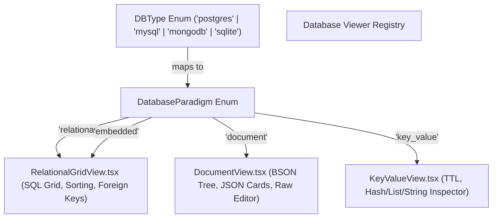
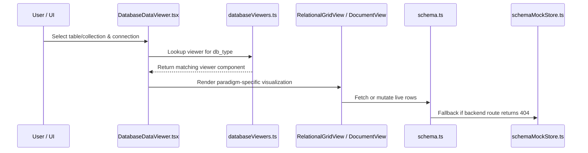

# Database Paradigm Viewer Registry & Schema API Cleanup Implementation Plan

## Executive Summary

This plan addresses two architectural improvements for SEASYN:
1. **Dynamic Database Viewer Registry**: Introducing a typed database paradigm enum (`DatabaseParadigm`) and component registry (`DatabaseDataViewer`) that dynamically resolves and renders the exact visualization needed for each database type (e.g., Relational Table for PostgreSQL/MySQL/SQLite, Document Tree/Cards for MongoDB, Key-Value for Redis), eliminating hardcoded `if (dbType === "mongodb")` checks throughout the codebase.
2. **Schema API File Cleanup**: Refactoring [`frontend/src/api/schema.ts`](file:///Users/janavi/Documents/Study/Projects/seasyn/frontend/src/api/schema.ts) from an 832-line monolithic file with embedded mock databases into a lean, professional ~80-line API client by cleanly isolating all mock stores and in-memory fallback CRUD logic into a dedicated module ([`frontend/src/api/mock/schemaMockStore.ts`](file:///Users/janavi/Documents/Study/Projects/seasyn/frontend/src/api/mock/schemaMockStore.ts)).

---

## 1. Architectural Design: Paradigm & Viewer Strategy

### 1.1 Database Paradigm Enum & Engine Mapping

Each database engine belongs to a high-level data paradigm:



### 1.2 Centralized Terminology System

Instead of scattered conditional checks throughout the UI, a unified helper provides contextual terminology:

```typescript
export type DatabaseParadigm = "relational" | "document" | "key_value" | "graph"

export interface DatabaseTerminology {
  paradigm: DatabaseParadigm
  entitySingular: string     // "Table" vs "Collection" vs "Key"
  entityPlural: string       // "Tables" vs "Collections" vs "Keys"
  recordSingular: string     // "Row" vs "Document" vs "Entry"
  recordPlural: string       // "Rows" vs "Documents" vs "Entries"
  fieldSingular: string      // "Column" vs "Field" vs "Property"
  fieldPlural: string        // "Columns" vs "Fields" vs "Properties"
  defaultViewMode: "table" | "documents" | "raw" | "key_value"
}
```

Mapping table:

| Engine (`db_type`) | Paradigm | Entity Plural | Record Plural | Field Plural | Primary Viewer |
| :--- | :--- | :--- | :--- | :--- | :--- |
| `postgres` | `relational` | Tables | Rows | Columns | `RelationalGridView` |
| `mysql` | `relational` | Tables | Rows | Columns | `RelationalGridView` |
| `sqlite` | `relational` | Tables | Rows | Columns | `RelationalGridView` |
| `mongodb` | `document` | Collections | Documents | Fields | `DocumentView` |
| `redis` *(future)* | `key_value` | Namespaces | Keys | Values | `KeyValueView` |

---

## 2. API Cleanup: Decoupling `schema.ts`

### 2.1 Current State vs Desired State

```
CURRENT (832 Lines - Monolithic):
frontend/src/api/schema.ts
├── 1-22: Imports & types
├── 23-495: Embedded mock seed data (users, products, orders, audit_logs) [~470 lines]
├── 496-832: API methods mixed with in-memory array filtering, sorting, pagination, and mutations [~340 lines]

PROPOSED CLEAN ARCHITECTURE:
frontend/src/api/
├── schema.ts (~80 lines)                <-- Pure typed Axios HTTP client
└── mock/
    └── schemaMockStore.ts (~500 lines)  <-- Isolated in-memory fallback simulation
```

### 2.2 Benefits of Decoupling
1. **Zero Production Overhead**: When the Go backend endpoints are active, the mock store is completely tree-shaken or bypassed.
2. **Readability**: Developers inspect `schema.ts` to see backend route definitions and request/response types in 2 seconds instead of scrolling through 800 lines of sample JSON.
3. **No Breaking Changes**: The external signature `schemaApi.getSchema(...)`, `schemaApi.getTableRows(...)`, etc., remains 100% identical.

---

## 3. Implementation Phases & File Plan



### Phase 1: Create Terminology & Paradigm Registry
- **File**: `frontend/src/lib/constants/databaseViewers.ts`
  - Define `DatabaseParadigm` enum.
  - Define `DATABASE_TERMINOLOGY: Record<DBType, DatabaseTerminology>`.
  - Helper `getDatabaseTerminology(dbType: string): DatabaseTerminology`.

### Phase 2: Decouple `schema.ts` into Dedicated Mock Store
- **New File**: `frontend/src/api/mock/schemaMockStore.ts`
  - Move `mockDbStore`, seed generators, and in-memory mock handlers (`mockGetSchema`, `mockGetTables`, `mockGetTableRows`, `mockUpdateRow`, `mockInsertRow`, `mockDeleteRow`, `mockGenerateDiff`) into this file.
- **Refactor**: `frontend/src/api/schema.ts`
  - Keep only typed `apiClient` HTTP calls.
  - In `catch` blocks, call `schemaMockStore[method]()` cleanly.
  - File size drops from **832 lines to ~80 lines**.

### Phase 3: Component Structure & Dynamic Dispatcher
- **Refactor**: `frontend/src/components/schema/LiveDataGrid.tsx` -> `RelationalGridView.tsx`
  - Standardize relational table grid (sorting, column types, cell editing, row insertion/deletion, CSV export).
- **New File**: `frontend/src/components/schema/DatabaseDataViewer.tsx`
  - Dynamic viewer dispatcher that receives `dbType` and renders:
    - If `paradigm === "document"` -> `<DocumentView />`
    - If `paradigm === "relational"` -> `<RelationalGridView />`
  - Exposes format switcher (`Table` vs `Documents` vs `Raw JSON`) so users can still cross-view data formats regardless of underlying engine.
- **Refactor**: `SchemaTree.tsx` & `TableStructureView.tsx`
  - Replace individual `isMongo` checks with `getDatabaseTerminology(dbType)`.

### Phase 4: Verification & Quality Assurance
- Format with Prettier (`pnpm --dir frontend format`).
- Run TypeScript typecheck, ESLint, and Prettier checks (`pnpm --dir frontend check`).
- Verify production bundle build (`pnpm --dir frontend build`).
- Verify zero regression across Schema Explorer, Live Data Grid, and Document View.

---

## 4. Verification Checklist

- [ ] `DatabaseParadigm` enum and registry cleanly resolve for all 4 supported databases (`postgres`, `mysql`, `mongodb`, `sqlite`).
- [ ] `schema.ts` is reduced from 832 lines to under 100 lines.
- [ ] Mock database operations reside completely in `frontend/src/api/mock/schemaMockStore.ts`.
- [ ] MongoDB collections automatically open in Document View (`DocumentView.tsx`).
- [ ] Relational databases open in SQL Table View (`RelationalGridView.tsx`).
- [ ] 0 TypeScript errors, 0 ESLint warnings, 0 formatting errors.
