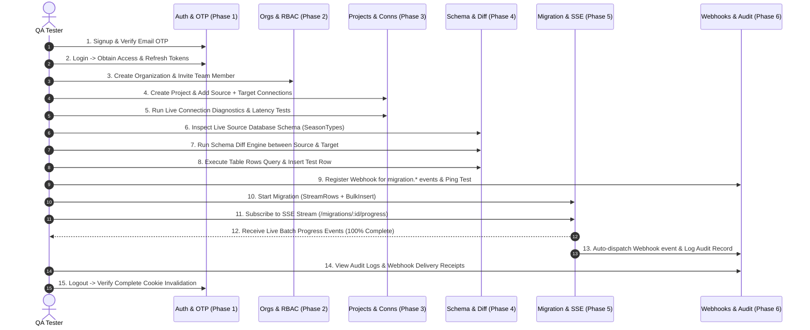

# SEASYN Platform — End-to-End Master QA Testing Manual (Phases 1 to 6)

This document is the **Comprehensive Master QA Testing Manual** for the SEASYN platform. It consolidates all endpoints, test scenarios, Swagger documentation, and verification checkpoints across all 6 phases into a unified testing guide.

---

## 🧭 Master Table of Contents

1. [Testing Environment & Setup](#1-testing-environment--setup)
2. [End-to-End Test Execution Flow](#2-end-to-end-test-execution-flow)
3. [Phase 1: Authentication, Security & OTP](#3-phase-1-authentication-security--otp)
4. [Phase 2: Organizations, Team Collaboration & RBAC](#4-phase-2-organizations-team-collaboration--rbac)
5. [Phase 3: Project & Database Connection Management](#5-phase-3-project--database-connection-management)
6. [Phase 4: Live Schema Inspection, Diff Engine & Data Explorer](#6-phase-4-live-schema-inspection-diff-engine--data-explorer)
7. [Phase 5: Migration Engine & Streaming Pipeline](#7-phase-5-migration-engine--streaming-pipeline)
8. [Phase 6: Webhooks, Team Notifications & Audit Logs](#8-phase-6-webhooks-team-notifications--audit-logs)
9. [Unified Master Checkpoints & Remarks Ledger](#9-unified-master-checkpoints--remarks-ledger)

---

## 1. Testing Environment & Setup

### Local Server Launch
```bash
cd backend/

# 1. Run database migrations & start server on :8080
DB_RUN=true go run cmd/server/main.go

# 2. Run automated test suite
go test -v ./...
```

### Swagger UI Testing
- **URL**: `http://localhost:8080/swagger/index.html`
- **Basic Auth Credentials**: `admin` / `secret` (or configured values from `.env`)
- **Bearer Token Authorization**: Click **Authorize** -> Enter `Bearer <token>` from Login response.

---

## 2. End-to-End Test Execution Flow



---

## 3. Phase 1: Authentication, Security & OTP

### Key Endpoints
- `POST /v1/auth/signup`
- `POST /v1/auth/login`
- `GET /v1/auth/me`
- `POST /v1/auth/otp/send`
- `POST /v1/auth/otp/verify`
- `POST /v1/auth/forgot-password`
- `POST /v1/auth/reset-password`
- `POST /v1/auth/logout`
- `GET /v1/auth/{provider}/login`
- `GET /v1/auth/{provider}/callback`

### Core Verification Steps
1. **User Signup**: Submit `email`, `password`, `first_name`, `last_name`. Verify HTTP `201` and `is_verified: false`.
2. **OTP Verification**: Trigger `POST /auth/otp/send` (`type: "verification"`). Verify template `verify_email_otp.html`. Submit code to `/auth/otp/verify`. Verify `is_verified: true`.
3. **Password Reset**: Trigger `/auth/forgot-password`. Verify template `password_reset_otp.html`. Reset password via `/auth/reset-password`.
4. **Cookie Security**: Verify `access_token` and `refresh_token` are set with `HttpOnly; SameSite=Lax`.
5. **Logout Invalidation**: Trigger `POST /auth/logout`. Verify response deletes cookies (`Max-Age=0`).

---

## 4. Phase 2: Organizations, Team Collaboration & RBAC

### Key Endpoints
- `POST /v1/organizations`
- `GET /v1/organizations`
- `GET /v1/organizations/{orgID}`
- `PUT /v1/organizations/{orgID}`
- `DELETE /v1/organizations/{orgID}`
- `GET /v1/organizations/{orgID}/members`
- `POST /v1/organizations/{orgID}/members`
- `PUT /v1/organizations/{orgID}/members/{userID}/role`
- `DELETE /v1/organizations/{orgID}/members/{userID}`

### Core Verification Steps
1. **Organization Creation**: Create organization with unique `slug`. Verify creator receives `owner` role.
2. **Slug Uniqueness**: Attempt duplicate slug; verify rejection with HTTP `400 Bad Request`.
3. **Team Invitations**: As `admin`, invite a member with role `member`. Verify listing in `/members`.
4. **RBAC Guard**: Verify `viewer` and `member` cannot invite other members (HTTP `403 Forbidden`).

---

## 5. Phase 3: Project & Database Connection Management

### Key Endpoints
- `POST /v1/organizations/{orgID}/projects`
- `GET /v1/organizations/{orgID}/projects`
- `GET /v1/organizations/{orgID}/projects/{projectID}`
- `POST /v1/organizations/{orgID}/projects/{projectID}/connections`
- `GET /v1/organizations/{orgID}/projects/{projectID}/connections`
- `POST /v1/organizations/{orgID}/projects/{projectID}/connections/test`
- `POST /v1/organizations/{orgID}/projects/{projectID}/connections/{connID}/test`

### Core Verification Steps
1. **Project Creation**: Create project with environment (`development`, `staging`, `production`).
2. **Add Connections**: Add source and target database configurations (PostgreSQL, MongoDB, MySQL, SQLite).
3. **AES-256-GCM Encryption**: Verify database password and URI are stored encrypted; verify API responses omit password fields.
4. **Connection Diagnostics**: Execute raw parameter test (`/connections/test`) and saved connection test (`/connections/{connID}/test`). Verify returned `latency_ms` and `server_info`.

---

## 6. Phase 4: Live Schema Inspection, Diff Engine & Data Explorer

### Key Endpoints
- `GET /v1/organizations/{orgID}/projects/{projectID}/connections/{connID}/schema`
- `GET /v1/organizations/{orgID}/projects/{projectID}/connections/{connID}/tables`
- `GET /v1/organizations/{orgID}/projects/{projectID}/connections/{connID}/tables/{tableName}`
- `GET /v1/organizations/{orgID}/projects/{projectID}/connections/{connID}/tables/{tableName}/rows`
- `POST /v1/organizations/{orgID}/projects/{projectID}/connections/{connID}/tables/{tableName}/rows`
- `PUT /v1/organizations/{orgID}/projects/{projectID}/connections/{connID}/tables/{tableName}/rows`
- `DELETE /v1/organizations/{orgID}/projects/{projectID}/connections/{connID}/tables/{tableName}/rows`
- `POST /v1/organizations/{orgID}/projects/{projectID}/schema/diff`

### Core Verification Steps
1. **Schema Introspection**: Inspect database schema. Verify `tables`, `columns`, `primary_keys`, `indexes`, and universal `SeasonType` mapping.
2. **Schema Diff Calculation**: Submit `source_connection_id` and `target_connection_id` to `/schema/diff`. Verify output arrays: `tables_added`, `tables_removed`, `tables_altered`, `tables_same`.
3. **Data Explorer (Row CRUD)**:
   - Query paginated rows with `page`, `limit`, `order_by`, `order_dir`.
   - Insert new row -> Verify HTTP `201 Created`.
   - Update row -> Verify updated fields.
   - Delete row -> Verify row removed.
   - SQL Injection check: Verify table/column identifiers are safely sanitized.

---

## 7. Phase 5: Migration Engine & Streaming Pipeline

### Key Endpoints
- `POST /v1/organizations/{orgID}/projects/{projectID}/migrations`
- `GET /v1/organizations/{orgID}/projects/{projectID}/migrations`
- `GET /v1/organizations/{orgID}/projects/{projectID}/migrations/{migrationID}`
- `DELETE /v1/organizations/{orgID}/projects/{projectID}/migrations/{migrationID}`
- `GET /v1/organizations/{orgID}/projects/{projectID}/migrations/{migrationID}/progress`

### Core Verification Steps
1. **Start Asynchronous Migration**: Submit `source_table`, `target_table`, `batch_size`. Verify immediate HTTP `201 Created` with job ID and calculated `total_rows`.
2. **SSE Progress Stream**: Open `GET /migrations/{id}/progress`. Verify stream headers (`text/event-stream`), initial `: connected` ping, batch progress updates, and final `100% completed` event.
3. **Execution Lock Protection**: While migration is running, attempt a second migration with identical parameters. Verify HTTP `409 Conflict` (`MIGRATION_ALREADY_RUNNING`).
4. **Cancellation**: Send `DELETE /migrations/{id}` on a running migration. Verify streaming aborts and status updates to `cancelled`.

---

## 8. Phase 6: Webhooks, Team Notifications & Audit Logs

### Key Endpoints
- `GET /v1/organizations/{orgID}/audit-logs`
- `POST /v1/organizations/{orgID}/webhooks`
- `GET /v1/organizations/{orgID}/webhooks`
- `GET /v1/organizations/{orgID}/webhooks/{webhookID}`
- `PUT /v1/organizations/{orgID}/webhooks/{webhookID}`
- `DELETE /v1/organizations/{orgID}/webhooks/{webhookID}`
- `POST /v1/organizations/{orgID}/webhooks/{webhookID}/test`
- `GET /v1/organizations/{orgID}/webhooks/{webhookID}/deliveries`

### Core Verification Steps
1. **Audit Log Inspection**: Query `/audit-logs`. Verify automatic entries for org actions, project creations, table edits, and migration start/completions with user IDs and IP addresses.
2. **Webhook Registration**: Create webhook for `migration.completed`. Save returned `secret`.
3. **Test Ping**: Trigger `POST /webhooks/{id}/test`. Verify test event received with signature header `X-Seasyn-Signature-256: sha256=...`.
4. **Automated Event Dispatch**: Run a migration to completion. Verify `GET /webhooks/{id}/deliveries` logs the successful HTTP dispatch.

---

## 9. Unified Master Checkpoints & Remarks Ledger

| Phase | Checkpoint ID | Verification Item | Status [PASS/FAIL] | Tester Remarks / Observed Failures / Edge Cases | Fixed? |
| :---: | :--- | :--- | :---: | :--- | :---: |
| **P1** | **CP-1.01** | User signup with valid email & password returns 201 | [ ] PASS | | |
| **P1** | **CP-1.02** | Duplicate email signup returns 400 Bad Request | [ ] PASS | | |
| **P1** | **CP-1.03** | Login returns tokens in HttpOnly cookies and JSON body | [ ] PASS | | |
| **P1** | **CP-1.04** | Email verification OTP sends branded template | [ ] PASS | | |
| **P1** | **CP-1.05** | Verify OTP marks user profile `is_verified: true` | [ ] PASS | | |
| **P1** | **CP-1.06** | Password reset OTP flow completes successfully | [ ] PASS | | |
| **P1** | **CP-1.07** | Logout endpoint completely clears session cookies | [ ] PASS | | |
| **P1** | **CP-1.08** | OAuth2 login URLs and callback error redirects work | [ ] PASS | | |
| **P2** | **CP-2.01** | Organization creation auto-assigns creator as `owner` | [ ] PASS | | |
| **P2** | **CP-2.02** | Duplicate organization slug is rejected | [ ] PASS | | |
| **P2** | **CP-2.03** | Member invitations respect RBAC hierarchy | [ ] PASS | | |
| **P2** | **CP-2.04** | Role updates (`admin`, `member`, `viewer`) take immediate effect | [ ] PASS | | |
| **P2** | **CP-2.05** | Only `owner` can delete an organization | [ ] PASS | | |
| **P3** | **CP-3.01** | Project creation with environment parameter | [ ] PASS | | |
| **P3** | **CP-3.02** | Database connection credentials encrypted with AES-256-GCM | [ ] PASS | | |
| **P3** | **CP-3.03** | Passwords omitted from all API responses | [ ] PASS | | |
| **P3** | **CP-3.04** | Direct and saved connection tests return latency metrics | [ ] PASS | | |
| **P4** | **CP-4.01** | Live schema inspection extracts tables, PKs, FKs, and indexes | [ ] PASS | | |
| **P4** | **CP-4.02** | Universal `SeasonType` mapping accurate across DB types | [ ] PASS | | |
| **P4** | **CP-4.03** | Schema diff identifies added, removed, and altered tables | [ ] PASS | | |
| **P4** | **CP-4.04** | Data Explorer paginated row queries and double-quote sanitization | [ ] PASS | | |
| **P4** | **CP-4.05** | Data Explorer Insert, Update, and Delete operations work | [ ] PASS | | |
| **P5** | **CP-5.01** | Start migration returns job ID immediately (non-blocking) | [ ] PASS | | |
| **P5** | **CP-5.02** | SSE stream broadcasts real-time progress events | [ ] PASS | | |
| **P5** | **CP-5.03** | Duplicate concurrent migration rejected with 409 Conflict | [ ] PASS | | |
| **P5** | **CP-5.04** | Cancel migration stops streaming and marks status `cancelled` | [ ] PASS | | |
| **P5** | **CP-5.05** | Completed migration writes 100% of rows to target table | [ ] PASS | | |
| **P6** | **CP-6.01** | Immutable audit logs record all critical platform events | [ ] PASS | | |
| **P6** | **CP-6.02** | Audit log query filters by user, action, and pagination | [ ] PASS | | |
| **P6** | **CP-6.03** | Webhook registration generates secret and returns once | [ ] PASS | | |
| **P6** | **CP-6.04** | Webhook dispatcher signs payloads with HMAC-SHA256 | [ ] PASS | | |
| **P6** | **CP-6.05** | Test webhook ping validates outbound connectivity | [ ] PASS | | |
| **P6** | **CP-6.06** | Migration lifecycle automatically triggers webhook dispatches | [ ] PASS | | |
| **P6** | **CP-6.07** | Webhook delivery logs record HTTP status and latency | [ ] PASS | | |
