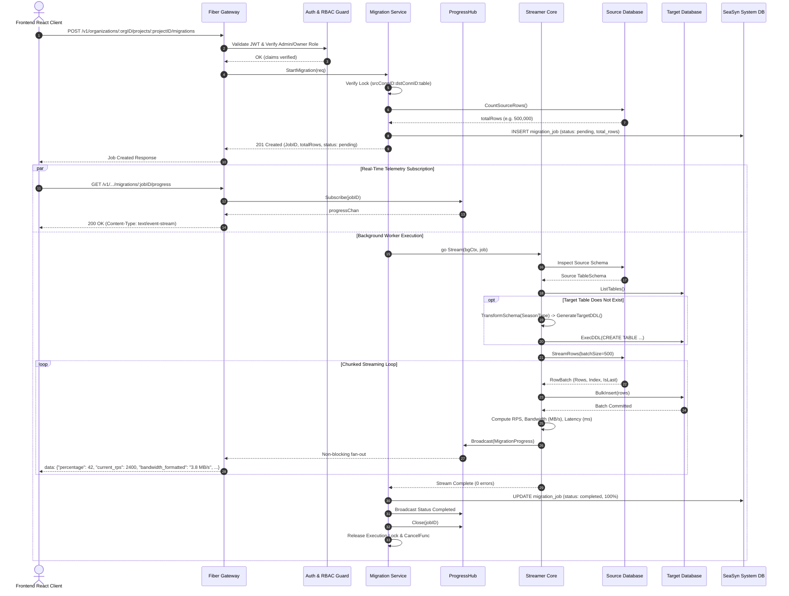

# 🌊 SeaSyn — Modern Full-Stack Database Migration & Live Telemetry Platform

[](https://github.com/Prince-695/seasyn/actions/workflows/build.yml)
[](https://github.com/Prince-695/seasyn/actions/workflows/backend.yml)
[](https://github.com/Prince-695/seasyn/actions/workflows/frontend.yml)
[](https://react.dev)
[](https://golang.org)
[](https://vitejs.dev)
[](https://tailwindcss.com)
[](https://gofiber.io)
[](https://postgresql.org)
[](http://localhost:8080/swagger/index.html)
[](LICENSE)

**SeaSyn** is an enterprise-ready, full-stack database migration, schema synchronization, and live telemetry platform. Built with a high-performance **Go (Fiber v2)** backend and a reactive **React 19 (Vite + Tailwind CSS v4 + TanStack Query)** frontend, SeaSyn eliminates the friction of moving data across heterogeneous database systems (PostgreSQL, MySQL, MongoDB, SQLite).

It combines **zero-OOM memory-safe channel streaming**, **dynamic Auto-DDL synthesis via canonical `SeasonType`**, and **real-time physics telemetry (moving graphs for RPS velocity, bandwidth MB/s, and batch latency)** streamed directly to the browser via HTML5 Server-Sent Events (SSE).

---

## 📑 Table of Contents

1. [Full-Stack Architecture Overview](#-full-stack-architecture-overview)
2. [End-to-End Migration Sequence Flow](#-end-to-end-migration-sequence-flow)
3. [Key Platform Features](#-key-platform-features)
4. [Universal Type System (`SeasonType`) & Auto-DDL](#-universal-type-system-seasontype--auto-ddl)
5. [Technology Stack](#-technology-stack)
6. [Monorepo Project Structure](#-monorepo-project-structure)
7. [Getting Started & Local Development](#-getting-started--local-development)
8. [API Catalog & Swagger UI](#-api-catalog--swagger-ui)
9. [Security, Encryption & RBAC](#-security-encryption--rbac)
10. [CI/CD Verification Standards](#-cicd-verification-standards)
11. [Subsystem Documentation Links](#-subsystem-documentation-links)

---

## 🏛 Full-Stack Architecture Overview

SeaSyn is architected as a decoupled, full-stack distributed system where the frontend dashboard interacts with the backend over both high-speed RESTful JSON APIs and persistent Server-Sent Events (SSE) streams:

```mermaid
flowchart TB
    %% ==========================================
    %% CLIENT & PRESENTATION LAYER
    %% ==========================================
    subgraph ClientLayer ["1. Frontend Presentation Layer (React 19 + Vite 7)"]
        UI_Studio["Frontend UI: Migration Studio & Analytics Dashboard"]
        UI_Wizard["Interactive Migration Wizard Modal<br/>(Source, Target, Table, BatchSize)"]
        UI_Chart["Live Physics Telemetry Charts<br/>(Moving RPS, Bandwidth MB/s, Latency ms)"]
        UI_SSE["SSE EventSource Consumer<br/>/v1/.../migrations/:id/progress"]
    end

    %% ==========================================
    %% API & SECURITY GATEWAY
    %% ==========================================
    subgraph GatewayLayer ["2. API & Security Gateway (Fiber v2 HTTP)"]
        GW_Router["Fiber Engine & URL Router (/v1)"]
        GW_Auth["JWT Dual-Transport Middleware<br/>(Extracts & Validates User Claims)"]
        GW_RBAC["RBAC & Tenant Guard<br/>(Requires Admin/Owner Role)"]
        GW_Val["Request DTO Validation<br/>(UUIDs, Identifier Sanitization)"]
        GW_SSE_Hdlr["SSE Streaming Handler<br/>(Chunked Transfer & Keepalive)"]
    end

    %% ==========================================
    %% CONTROL PLANE & ORCHESTRATION
    %% ==========================================
    subgraph ControlPlane ["3. Orchestration & Control Plane (Migration Service)"]
        JobService["Migration Service<br/>(Lifecycle Coordinator)"]
        ExecLock["Concurrent Execution Lock<br/>(sync.Map: srcConn:dstConn:table)"]
        CancelRegistry["Cancellation Controller<br/>(sync.Map: jobID -> context.CancelFunc)"]
        StateEngine["Job State Coordinator<br/>(Pending -> Running -> Completed/Failed)"]
        AuditEmitter["Audit Log Service<br/>(migration.started/completed/failed)"]
        WebhookEmitter["Webhook Dispatcher<br/>(Async HTTP Dispatch to Integrations)"]
    end

    %% ==========================================
    %% STREAMING PIPELINE & EXECUTION CORE
    %% ==========================================
    subgraph ExecutionCore ["4. Streaming Pipeline Core (Streamer)"]
        Streamer["Streamer Engine"]
        CryptoEngine["Credential Decryptor<br/>(AES-GCM Decryption of URI & Passwords)"]
        Preflight["Pre-flight Inspector<br/>(Source Row Count & Target Check)"]
        SchemaTransformer["Canonical Schema Transformer<br/>(Source Types -> SeasonType -> Target Types)"]
        DDLEngine["Auto-DDL Synthesizer<br/>(Generates & Applies Missing CREATE TABLE)"]
        RowChannel["Buffered Row Batch Channel<br/>(chan domain.RowBatch, cap=4)"]
        ErrChannel["Error Channel<br/>(chan error, cap=1)"]
        MetricsComputer["Telemetry Computer<br/>(Computes RPS, Bandwidth, Batch Latency)"]
    end

    %% ==========================================
    %% REAL-TIME TELEMETRY FAN-OUT
    %% ==========================================
    subgraph TelemetryHub ["5. Real-Time Telemetry Broker (ProgressHub)"]
        Hub["ProgressHub (In-Memory Pub/Sub)"]
        SubRegistry["Subscriber Map (sync.RWMutex)<br/>map[jobID][]chan MigrationProgress"]
        Broadcaster["Non-Blocking Broadcaster<br/>(Drops Slow Clients to Avoid Pipeline Pauses)"]
    end

    %% ==========================================
    %% HETEROGENEOUS ADAPTER LAYER
    %% ==========================================
    subgraph AdapterLayer ["6. Heterogeneous Driver Adapters (Hexagonal Ports)"]
        Registry["Adapter Registry (Engine Factory)"]
        PGAdapter["PostgreSQL Adapter (pgx/v5)<br/>StreamRows: ORDER BY ctid<br/>BulkInsert: Multi-row parameterized"]
        MySQLAdapter["MySQL Adapter (go-sql-driver)<br/>StreamRows: Keyset/Offset paging<br/>BulkInsert: Multi-value INSERT"]
        MongoAdapter["MongoDB Adapter (mongo-driver)<br/>StreamRows: Cursor batching<br/>BulkInsert: InsertMany (BSON)"]
        SQLiteAdapter["SQLite Adapter (modernc)<br/>StreamRows: Fast local cursor<br/>BulkInsert: Transaction batch"]
    end

    %% ==========================================
    %% STORAGE & INFRASTRUCTURE
    %% ==========================================
    subgraph StorageLayer ["7. Storage & Infrastructure Layer"]
        SystemDB["SeaSyn Core DB (PostgreSQL)<br/>migration_jobs, audit_logs, users, connections"]
        SourceDB["Source Database<br/>(Postgres, MySQL, Mongo, SQLite)"]
        TargetDB["Target Database<br/>(Postgres, MySQL, Mongo, SQLite)"]
    end

    %% Flow Connections
    UI_Wizard -->|"POST /v1/.../migrations"| GW_Router
    UI_SSE -->|"GET /v1/.../migrations/:id/progress"| GW_Router
    GW_Router --> GW_Auth --> GW_RBAC --> GW_Val
    GW_Val -->|"StartMigration()"| JobService
    GW_Router -->|"CancelMigration()"| JobService
    GW_Router -->|"ProgressStream()"| GW_SSE_Hdlr
    GW_SSE_Hdlr <-->|"Subscribe / Read"| Hub

    JobService -->|"Verify & Acquire Lock"| ExecLock
    JobService -->|"Register context.CancelFunc"| CancelRegistry
    JobService -->|"Create & Update Job Record"| SystemDB
    JobService -->|"Emit Event"| AuditEmitter
    JobService -->|"Dispatch Hook"| WebhookEmitter
    JobService -->|"Launch Goroutine"| Streamer

    Streamer -->|"Decrypt Passwords & URIs"| CryptoEngine
    Streamer -->|"Resolve Driver Adapters"| Registry
    Registry --> PGAdapter
    Registry --> MySQLAdapter
    Registry --> MongoAdapter
    Registry --> SQLiteAdapter

    Streamer -->|"1. Count Rows & Check Target"| Preflight
    Preflight --> SourceDB
    Streamer -->|"2. Schema Diff & Auto-Provision"| SchemaTransformer
    SchemaTransformer --> DDLEngine
    DDLEngine -->|"Execute CREATE TABLE if needed"| TargetDB

    Streamer -->|"3. Open StreamRows()"| SourceDB
    SourceDB -.->|"Chunked Batches"| RowChannel
    SourceDB -.->|"Read Errors"| ErrChannel

    RowChannel -->|"4. Consume Batch"| Streamer
    Streamer -->|"5. BulkInsert(rows)"| TargetDB
    Streamer -->|"6. Calculate Velocity & Latency"| MetricsComputer
    MetricsComputer -->|"7. Broadcast(Progress)"| Hub

    Hub --> Broadcaster
    Broadcaster --> SubRegistry
    SubRegistry -->|"Push Event Payload"| GW_SSE_Hdlr
    GW_SSE_Hdlr -->|"SSE Stream: data: {...}"| UI_Chart
```



---

## 🔁 End-to-End Migration Sequence Flow



---

## ✨ Key Platform Features

- **Reactive Telemetry Graphs**: Live moving charts in the frontend render instantaneous Throughput (Rows/sec), Bandwidth (MB/s), and Batch Latency (ms) in real time over SSE.
- **Zero-OOM Bounded Pipeline**: Bounded channel pipeline (`chan domain.RowBatch, cap=4`) enforces flat memory usage ($<64\text{ MB}$) regardless of table size.
- **Dynamic Auto-DDL Synthesis**: Converts heterogeneous source schemas into universal `SeasonType` abstractions and creates missing target tables automatically.
- **Visual Schema Diff & Data Explorer**: Interactively compare schemas across databases and explore table records with sorting, filtering, and row inspection.
- **Concurrency Collision Guard**: Thread-safe `sync.Map` mutex preventing duplicate concurrent runs on identical source/target datasets.
- **Cooperative Cancellation**: Instantly abort running jobs with `context.WithCancel` without corrupting transaction states or socket handles.
- **Enterprise Multi-Tenancy**: Organization and project isolation backed by RBAC (Owner, Admin, Member, Viewer).
- **AES-256-GCM Vault**: Credentials and connection URIs encrypted at rest with random nonces.
- **Sliding JWT Sessions**: Bearer header fallback with secure HttpOnly cookies, sliding token rotation, and Swagger isolation.
- **Outbound Webhooks**: HMAC-SHA256 signed event delivery for external pipeline automation.

---

## 🔄 Universal Type System (`SeasonType`) & Auto-DDL

To seamlessly convert types between SQL engines (Postgres, MySQL, SQLite) and document databases (MongoDB), SeaSyn maps native driver types through an intermediate canonical representation:

<p align="center">
  
</p>

### Canonical Mapping Matrix

| `SeasonType` | PostgreSQL (`pgx`) | MySQL (`go-sql-driver`) | MongoDB (`mongo-driver`) | SQLite (`modernc`) |
|---|---|---|---|---|
| `SeasonTypeInt` | `BIGINT` | `BIGINT` | `int` / `long` | `INTEGER` |
| `SeasonTypeString` | `TEXT` | `TEXT` | `string` | `TEXT` |
| `SeasonTypeBool` | `BOOLEAN` | `TINYINT(1)` | `bool` | `INTEGER` |
| `SeasonTypeTimestamp` | `TIMESTAMPTZ` | `DATETIME(6)` | `date` | `TEXT` |
| `SeasonTypeJSON` | `JSONB` | `JSON` | `object` | `TEXT` |
| `SeasonTypeFloat` | `DOUBLE PRECISION` | `DOUBLE` | `double` | `REAL` |
| `SeasonTypeDecimal` | `NUMERIC` | `DECIMAL(38,18)` | `decimal` | `NUMERIC` |
| `SeasonTypeBinary` | `BYTEA` | `LONGBLOB` | `binData` | `BLOB` |
| `SeasonTypeUUID` | `UUID` | `CHAR(36)` | `string` | `TEXT` |

---

## 🛠 Technology Stack

### Frontend Architecture
- **Framework**: [React 19](https://react.dev) + [Vite 7](https://vitejs.dev) + [TypeScript](https://www.typescriptlang.org)
- **Styling & Animation**: [Tailwind CSS v4](https://tailwindcss.com), [Framer Motion](https://www.framer.com/motion), [Lucide Icons](https://lucide.dev), [Geist Font](https://vercel.com/font)
- **State Management & Data Fetching**: [TanStack React Query v5](https://tanstack.com/query/latest), [Zustand](https://github.com/pmndrs/zustand), [Axios](https://axios-http.com)
- **Forms & Validation**: [React Hook Form](https://react-hook-form.com), [Zod](https://zod.dev)

### Backend Architecture
- **Language**: [Go 1.25+](https://golang.org)
- **Web Framework**: [Fiber v2](https://gofiber.io) (v2.52)
- **ORM & Data Modeling**: [GORM](https://gorm.io) (v1.31) with PostgreSQL Driver
- **Heterogeneous Drivers**:
  - PostgreSQL: `github.com/jackc/pgx/v5`
  - MySQL: `github.com/go-sql-driver/mysql`
  - MongoDB: `go.mongodb.org/mongo-driver`
  - SQLite: `modernc.org/sqlite` (Pure Go)
- **Security & Utilities**: `golang-jwt/jwt/v5`, `golang.org/x/crypto` (Argon2id, AES-256-GCM), `swaggo/swag`, `go-playground/validator/v10`

---

## 🗂 Monorepo Project Structure

```
seasyn/
├── backend/                        # Go (Fiber v2) Backend Services
│   ├── cmd/server/main.go          # Application bootstrap & dependency injection
│   ├── docs/                       # Swagger / OpenAPI 3.0 documentation
│   │   └── assets/                 # Architecture diagram assets & SVGs
│   ├── internal/                   # Hexagonal Architecture core modules
│   │   ├── adapters/               # Database drivers (PostgreSQL, MySQL, MongoDB, SQLite)
│   │   ├── domain/                 # Domain entities, DTOs, Enums, and Value Objects
│   │   ├── http/                   # Controllers, Handlers & Security Middlewares
│   │   ├── ports/                  # Inbound and Outbound interfaces
│   │   ├── repository/             # GORM persistence layer
│   │   └── services/               # Core business orchestrators (Migration, Auth, Analytics)
│   └── pkg/                        # Shared packages (Crypto, Errors, Mail)
├── frontend/                       # React 19 + TypeScript + Vite 7 Frontend
│   ├── src/
│   │   ├── api/                    # Axios API client & TanStack React Query hooks
│   │   ├── components/             # Reusable UI components, modals, and telemetry charts
│   │   ├── pages/                  # Route views (Dashboard, Studio, Auth, Connections)
│   │   └── store/                  # Zustand global application state
│   └── package.json                # Frontend dependencies and build scripts
├── Docs/                           # Technical Specifications & Documentation Portal
│   ├── assets/                     # Architecture SeasonType SVG
│   ├── backend/                    # Backend architecture documents & HLD specifications
│   ├── testing/                    # Test plans, QA validation reports & audit runs
│   ├── ci.md                       # Pre-PR continuous integration verification standards
│   └── README.md                   # Full-stack documentation index & engineering portal
├── .github/workflows/              # GitHub Actions CI/CD pipelines (Backend, Frontend, Full Build)
├── README.md                       # Root Project README (this document)
└── LICENSE                         # MIT Open Source License
```

---

## 🚀 Getting Started & Local Development

### Prerequisites
- **Go**: Version `1.23+` (Tested on `1.25.x`)
- **Node.js**: Version `20+` & **pnpm**: Version `9+`
- **PostgreSQL**: Version `15+` (Local or Neon/Supabase instance)

### 1. Clone the Monorepo
```bash
git clone https://github.com/Prince-695/seasyn.git
cd seasyn
```

---

### 2. Start the Backend
Open a terminal for the backend:
```bash
cd backend

# Copy environment variables
cp .env.example .env

# Download Go module dependencies
go mod tidy

# Start the dev server (runs GORM AutoMigrate against your DB)
go run cmd/server/main.go
```
The backend initializes and binds to port **`8080`**:
- **Health Check**: `http://localhost:8080/health`
- **API Base Route**: `http://localhost:8080/v1`
- **Interactive Swagger Documentation**: `http://localhost:8080/swagger/index.html`

---

### 3. Start the Frontend
Open a second terminal for the frontend:
```bash
cd frontend

# Install Node dependencies
pnpm install

# Start Vite dev server
pnpm dev
```
The frontend launches at **`http://localhost:5173`** (or next available port).

---

## 📡 API Catalog & Swagger UI

Interactive OpenAPI 3.0 documentation is served at **`http://localhost:8080/swagger/index.html`**.

| Domain | Method | Endpoint Path | Description | Access Scope |
|---|---|---|---|---|
| **Auth** | `POST` | `/v1/auth/signup` | Register new user account | Public |
| **Auth** | `POST` | `/v1/auth/login` | Authenticate user & issue tokens | Public |
| **Auth** | `POST` | `/v1/auth/refresh` | Rotate access token | Public / Cookie |
| **Auth** | `GET` | `/v1/auth/me` | Fetch authenticated user profile | Bearer Token |
| **Organizations** | `POST` | `/v1/organizations` | Create an organization | Bearer Token |
| **Organizations** | `GET` | `/v1/organizations` | List user organizations | Bearer Token |
| **Projects** | `POST` | `/v1/organizations/:orgID/projects` | Create a sync project | Admin / Owner |
| **Connections** | `POST` | `/v1/organizations/:orgID/projects/:projectID/connections` | Add encrypted database connection | Admin / Owner |
| **Connections** | `POST` | `/v1/.../connections/test` | Ping & test connection diagnostics | Admin / Owner |
| **Schema Editor** | `POST` | `/v1/.../schema/diff` | Compare schemas between connections | Member+ |
| **Data Explorer** | `GET` | `/v1/.../connections/:connID/tables/:table/rows` | Query table records with filters | Member+ |
| **Migration** | `POST` | `/v1/.../projects/:projectID/migrations` | Launch background migration | Admin / Owner |
| **Migration** | `GET` | `/v1/.../projects/:projectID/migrations` | List migration history | Member+ |
| **Migration** | `DELETE` | `/v1/.../migrations/:jobID` | Cooperatively cancel running job | Admin / Owner |
| **Migration** | `GET` | `/v1/.../migrations/:jobID/progress` | **Live SSE Progress Stream** | Member+ |
| **Analytics** | `GET` | `/v1/organizations/:orgID/analytics/overview` | Organization analytics & quotas | Member+ |
| **Analytics** | `GET` | `/v1/.../projects/:projectID/analytics` | Project topology & heatmap | Member+ |
| **Analytics** | `GET` | `/v1/.../projects/:projectID/migrations/analytics` | Migration Studio historical intelligence | Member+ |
| **Webhooks** | `POST` | `/v1/organizations/:orgID/webhooks` | Register outbound webhook | Admin / Owner |
| **Audit Logs** | `GET` | `/v1/organizations/:orgID/audit-logs` | Query tenant security audit log | Admin / Owner |

---

## 🔒 Security, Encryption & RBAC

1. **Vault Encryption at Rest**: Passwords and URIs are encrypted using **AES-256-GCM** with unique nonces before writing to PostgreSQL.
2. **Password Security**: Authenticated credentials are hashed with **Argon2id**.
3. **Dual-Transport Sessions**:
   - `Authorization: Bearer <token>` for API clients, Swagger, and CLI tools.
   - Secure `HttpOnly` cookies with sliding window auto-refresh for browser sessions.
   - Swagger Isolation: Referer-based cookie suppression ensures strict Swagger testing.
4. **RBAC Permissions**:
   - 👑 **Owner**: Full tenant control, organization deletion, billing, role modifications.
   - 🛡️ **Admin**: Launch/cancel migrations, add database connections, configure webhooks, view audit logs.
   - 👤 **Member**: Inspect schemas, explore table rows, view analytics dashboards.
   - 👁️ **Viewer**: Read-only overview of projects and migration history.

---

## 🧪 CI/CD Verification Standards

Per repository specifications ([Docs/ci.md](Docs/ci.md)), run all checks locally before opening pull requests:

```bash
# Backend Quality Checks (from backend/):
find . -name '*.go' -print0 | xargs -0 gofmt -w
go vet ./...
golangci-lint run ./...
go test -count=1 ./...
go build ./...

# Frontend Quality Checks (from frontend/):
pnpm format:check
pnpm lint
pnpm typecheck
pnpm build
```

---

## 📖 Subsystem Documentation Links

- [Backend Deep-Dive & Architecture Guide](backend/README.md)
- [System Architecture & Documentation Portal](Docs/README.md)
- [Migration Engine High-Level Design (HLD) Document](Docs/backend/migration_engine_hld.md)
- [Continuous Integration Checklist](Docs/ci.md)
- [Authentication QA & Verification Report](Docs/testing/auth_qa_report.md)

---

## 📄 License

SeaSyn is open-source software licensed under the **[MIT License](LICENSE)**.
