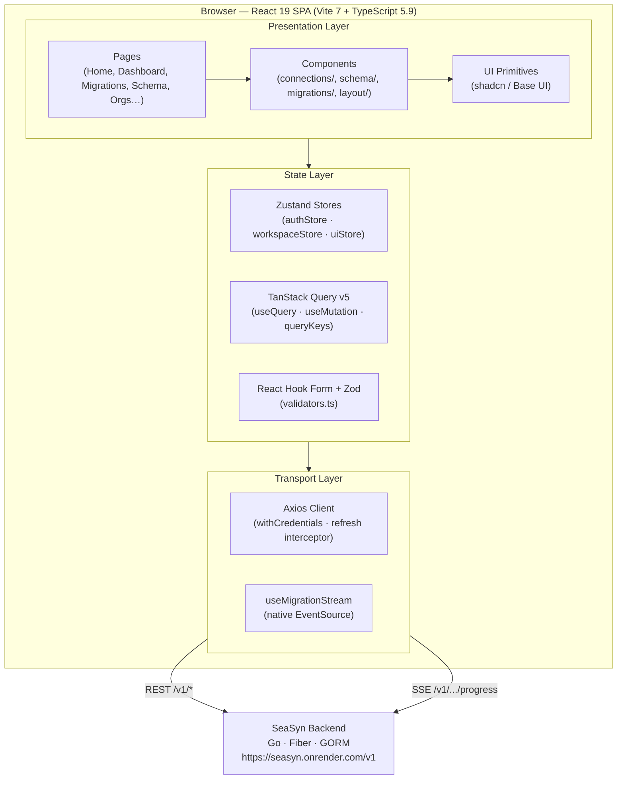
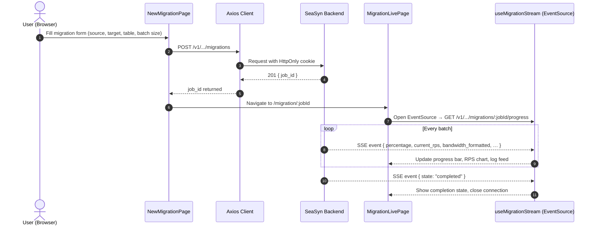

# 🌊 SeaSyn Frontend — Real-Time Database Migration Dashboard

[](https://react.dev)
[](https://typescriptlang.org)
[](https://vite.dev)
[](https://tailwindcss.com)
[](LICENSE)

The **SeaSyn Frontend** is a React 19 SPA that serves as the operational control plane for cross-database migrations. It provides a live dashboard for tracking SSE-streamed migration telemetry, an interactive schema studio for cross-engine type mapping, a connection wizard for managing heterogeneous database adapters, and an analytics suite for org-level health monitoring — all integrated with the SeaSyn backend via a cookie-authenticated Axios client.

---

## 📑 Table of Contents

1. [System Overview & Key Capabilities](#-system-overview--key-capabilities)
2. [Application Architecture](#-application-architecture)
   - [Layer Breakdown](#layer-breakdown)
   - [User Journey Sequence](#user-journey-sequence)
   - [Routing & Auth Flow](#routing--auth-flow)
3. [Supported Database Engines](#-supported-database-engines)
4. [SeasonType Schema Mapping Visualization](#-seasontype-schema-mapping-visualization)
5. [Project Environment System](#-project-environment-system)
6. [Project Structure](#-project-structure)
7. [Page & Feature Catalog](#-page--feature-catalog)
8. [State Management & Data Fetching](#-state-management--data-fetching)
9. [Real-Time SSE Telemetry Consumer](#-real-time-sse-telemetry-consumer)
10. [Security, RBAC & Auth Architecture](#-security-rbac--auth-architecture)
11. [Local Development & Getting Started](#-local-development--getting-started)
12. [CI/CD Checks & Code Standards](#-cicd-checks--code-standards)

---

## 🔭 System Overview & Key Capabilities

| Capability | Implementation |
|---|---|
| **Live Migration Dashboard** | SSE consumer via `useMigrationStream` hook; streams RPS, bandwidth, percentage, and batch latency in real time |
| **Schema Studio** | Cross-engine field mapping view with `SeasonType` diff visualization (`SchemaDiffPage`, `SchemaExplorerPage`) |
| **Connection Wizard** | Multi-step connection form with live diagnostic ping (`useConnectionWizard`, `ConnectionsPage`) |
| **Organization & RBAC** | Owner / Admin / Member / Viewer role enforcement via `useHasPermission` + `PermissionGuard` |
| **Analytics Suite** | Org-level quota gauge, velocity timeline, engine distribution heatmap (`Dashboard.tsx`) |
| **Interactive Playground** | Live SQL ↔ NoSQL schema conversion tool with streaming animation (`Playground.tsx`) |
| **Multi-Tenant Workspace** | Per-org project isolation with `workspaceStore` (Zustand) holding active org/project context |
| **Dark / Light Theming** | CSS variable-based design system via `ThemeProvider`; Figtree + EB Garamond typography |
| **Token-Transparent Auth** | HttpOnly cookie sessions; singleton Axios refresh interceptor with race-condition protection |

---

## 🏗 Application Architecture

### Layer Breakdown



---

### User Journey Sequence



---

### Routing & Auth Flow

- `router/index.tsx` — `createBrowserRouter` with all application routes
- `router/ProtectedRoute.tsx` — Guards all authenticated routes; redirects to `/sign-in` if `isAuthenticated` is false
- `hooks/useAuth.ts` — Hydrates session from `GET /v1/auth/me` on app mount; populates `authStore`
- `App.tsx` — `QueryClientProvider` → `ThemeProvider` → `AuthInitializer` → `RouterProvider`

---

## 🔌 Supported Database Engines

Defined in `lib/constants/engines.ts` — `ENGINES[]` and `ENGINE_DEFAULTS`.

| Engine | Paradigm | Default Port |
|---|---|---|
| **PostgreSQL** | Relational · SQL | `5432` |
| **MySQL** | Relational · SQL | `3306` |
| **MongoDB** | Document · NoSQL | `27017` |
| **SQLite** | Embedded · SQL | — (file path) |

All four engines render with `EngineIcon.tsx` (via `react-icons/si`) and carry engine-specific connection defaults (`ssl_mode`, `port`) pre-filled in the connection wizard.

---

## 🔄 SeasonType Schema Mapping Visualization

The Schema Studio surfaces **canonical cross-engine type mappings** defined in `lib/constants/schemaMappings.ts`. These same mappings drive the `SchemaDiffPage` side-by-side diff and the `SeasonTypeBadge` component.

| Source Type (SQL) | Source Example | Target Type (BSON) | Target Example | Behaviour |
|---|---|---|---|---|
| `UUID` | `user_id: UUID` | `ObjectId` | `_id: ObjectId` | Auto-coerced |
| `JSONB` | `config: JSONB` | `Doc` | `config: Doc` | Preserved |
| `TIMESTAMPTZ` | `ts: TIMESTAMPTZ` | `ISODate` | `ts: ISODate` | Normalized |
| `VARCHAR(255)` | `name: VARCHAR(255)` | `String` | `name: String` | Mapped |
| `BOOLEAN` | `is_active: BOOLEAN` | `Boolean` | `is_active: Boolean` | Preserved |

> These mappings are the frontend representation of the backend's `SeasonType` universal type system. See the [Backend README](../backend/README.md) for the full canonical type registry.

---

## 🏷 Project Environment System

Defined in `lib/constants/environments.ts` — `ENVIRONMENT_CONFIG`. Projects are tagged with one of three environments, which drives badge styling and filter tabs throughout the dashboard.

| Environment | Badge Label | Usage |
|---|---|---|
| `development` | `Dev` | Local & experimental work |
| `staging` | `Staging` | Pre-production validation |
| `production` | `Prod` | Live traffic workloads |

Filter options (`all · Dev · Staging · Prod`) are rendered via `SegmentedControl` on the Projects list view.

---

## 📁 Project Structure

```
frontend/
├── src/
│   ├── api/                        # Axios API modules
│   │   ├── client.ts               # Axios instance + refresh interceptor
│   │   ├── auth.ts                 # Auth endpoints (login, signup, refresh, me)
│   │   ├── migrations.ts           # Migration CRUD + SSE stream initiator
│   │   ├── connections.ts          # Connection save, test, delete
│   │   ├── projects.ts             # Project CRUD
│   │   ├── orgs.ts                 # Org management + member invites
│   │   ├── schema.ts               # Schema explore + diff endpoints
│   │   ├── analytics.ts            # Org & project analytics
│   │   └── types.ts                # API-layer type re-exports
│   │
│   ├── components/
│   │   ├── auth/                   # PermissionGuard, RoleBadge
│   │   ├── connections/            # EngineIcon, ConnectionCard, ConnectionWizard
│   │   ├── dashboard/              # DashboardMetricStrip, AnalyticsCards
│   │   ├── home/                   # Landing page sections + dashPreviews/
│   │   │   ├── dashPreviews/       # Interactive live dashboard preview
│   │   │   ├── features/           # Feature mockup components
│   │   │   └── playground/         # SQL↔NoSQL conversion playground
│   │   ├── layout/                 # MainLayout, Sidebar, Navbar, ComingSoon
│   │   ├── migrations/             # MigrationStatusBadge, PipelineFlowRibbon
│   │   ├── orgs/                   # Org member/role management components
│   │   ├── projects/               # ProjectCard, ProjectSettingsTab
│   │   ├── schema/                 # SchemaTree, TableStructureView, SeasonTypeBadge, SchemaDiff
│   │   ├── ui/                     # shadcn/Base UI primitives
│   │   └── theme-provider.tsx      # Dark/light theme context
│   │
│   ├── hooks/                      # Custom React hooks
│   │   ├── useAuth.ts              # Session hydration on mount
│   │   ├── useMigrationStream.ts   # SSE telemetry consumer
│   │   ├── useConnectionWizard.ts  # Multi-step connection form state
│   │   ├── useSchemaExplorer.ts    # Schema tree fetch + state
│   │   ├── useOrgConnections.ts    # Org-scoped connection list
│   │   ├── useActiveProject.ts     # Active project resolution
│   │   ├── useHasPermission.ts     # RBAC permission check
│   │   ├── useFilteredList.ts      # Generic search + filter hook
│   │   └── useTableMutations.ts    # Table row CRUD mutations
│   │
│   ├── lib/
│   │   ├── constants/
│   │   │   ├── engines.ts          # ENGINES[], ENGINE_DEFAULTS (ports, ssl_mode)
│   │   │   ├── environments.ts     # ENVIRONMENT_CONFIG (dev · staging · prod)
│   │   │   ├── roles.ts            # ROLE_CONFIG (owner · admin · member · viewer)
│   │   │   ├── migrations.ts       # Migration status constants
│   │   │   ├── schemaMappings.ts   # CANONICAL_SCHEMA_MAPPINGS (SeasonType)
│   │   │   ├── databaseViewers.ts  # DB viewer config
│   │   │   └── playgroundPresets.ts # SQL↔NoSQL playground preset queries
│   │   ├── validators.ts           # Composed Zod schemas (emailField, passwordField, etc.)
│   │   ├── queryClient.ts          # TanStack Query client config
│   │   ├── queryKeys.ts            # Canonical query key factory
│   │   ├── formatters.ts           # Number, date, byte formatters
│   │   ├── migrationMetrics.ts     # RPS / bandwidth calculation helpers
│   │   ├── migrationStatus.ts      # Status color + label mapping
│   │   ├── errors.ts               # API error normalization
│   │   └── utils.ts                # cn() and shared utilities
│   │
│   ├── pages/
│   │   ├── home/Home.tsx           # Landing page
│   │   ├── auth/                   # SignIn, SignUp, ForgotPass, ResetPass, VerifyEmail, OAuthSuccess
│   │   ├── dashboard/Dashboard.tsx # Org analytics overview
│   │   ├── projects/               # ProjectDetailsPage, ProjectSettingsPage
│   │   ├── connections/            # ConnectionsPage
│   │   ├── migrations/             # MigrationsPage, NewMigrationPage, MigrationLivePage
│   │   ├── schema/                 # SchemaExplorerPage, SchemaDiffPage
│   │   ├── orgs/                   # MembersPage, OrgSettingsPage
│   │   ├── account/                # ProfilePage
│   │   └── legal/                  # TermsPage, PrivacyPolicyPage, CookiePolicyPage
│   │
│   ├── router/
│   │   ├── index.tsx               # createBrowserRouter — all application routes
│   │   └── ProtectedRoute.tsx      # Auth guard wrapper
│   │
│   ├── store/
│   │   ├── authStore.ts            # Zustand — user session, isAuthenticated, isInitialized
│   │   ├── workspaceStore.ts       # Zustand — active org, project, sidebar state
│   │   └── uiStore.ts              # Zustand — global UI flags (modals, toasts)
│   │
│   ├── types/
│   │   ├── index.ts                # Shared domain types (User, DBType, Connection, Project…)
│   │   ├── auth.ts                 # Auth contracts & payload types
│   │   ├── migration.ts            # MigrationJob, MigrationProgress, MigrationStatus
│   │   ├── analytics.ts            # OrgQuotasSummary, EngineDistributionItem, DailyVelocityPoint
│   │   ├── org.ts                  # OrgRole, OrgMember, Organization
│   │   ├── project.ts              # Project, ProjectDetails
│   │   └── schema.ts               # SchemaColumn, SeasonType, SchemaDiff
│   │
│   ├── App.tsx                     # Root provider tree
│   ├── main.tsx                    # Vite entry point
│   └── index.css                   # Tailwind v4 + CSS variable design tokens
│
├── public/
│   ├── dashboard.png               # Light mode dashboard screenshot (preview)
│   └── dashboard-dark.png          # Dark mode dashboard screenshot (preview)
│
├── vite.config.ts                  # Vite config — Tailwind plugin + /v1 proxy
├── tsconfig.json
└── package.json                    # pnpm workspace manifest
```

---

## 📄 Page & Feature Catalog

| Route | Page | Description | Auth |
|---|---|---|---|
| `/` | `Home` | Landing page: Hero, Dashboard Preview, Features, Playground, HowItWorks, FAQ, CTA | Public |
| `/sign-in` | `SignIn` | Email/password login + Google OAuth | Public |
| `/sign-up` | `SignUp` | Registration with email OTP verification | Public |
| `/verify-email` | `VerifyEmail` | OTP confirmation step post-signup | Public |
| `/forgot-password` | `ForgotPass` | Password reset initiation | Public |
| `/reset-password` | `ResetPass` | Token-gated password update | Public |
| `/auth/:provider/callback` | `OAuthSuccess` | OAuth popup callback — exchanges code, posts token to parent window | Public |
| `/privacy-policy` | `PrivacyPolicyPage` | Privacy policy | Public |
| `/privacy` | — | Redirects → `/privacy-policy` | Public |
| `/terms-and-conditions` | `TermsPage` | Terms of service | Public |
| `/terms` | — | Redirects → `/terms-and-conditions` | Public |
| `/cookie-policy` | `CookiePolicyPage` | Cookie policy | Public |
| `/docs` | `ComingSoon` | Documentation placeholder | Public |
| `/dashboard` | `Dashboard` | Org analytics: quota gauges, velocity timeline, engine distribution | Protected |
| `/projects/:projectSlug` | `ProjectDetailsPage` | Project overview, connection list, quick actions | Protected |
| `/projects/:projectSlug/settings` | `ProjectSettingsPage` | Rename project, danger zone | Protected |
| `/connections` | `ConnectionsPage` | List + add source/target database connections with live ping | Protected |
| `/migration` | `MigrationsPage` | Migration history with status badges and analytics | Protected |
| `/migration/new` | `NewMigrationPage` | Multi-step migration setup form | Protected (Admin+) |
| `/migration/:jobId` | `MigrationLivePage` | Real-time SSE telemetry stream, progress bar, log feed | Protected |
| `/migration/:projectSlug/:jobId` | `MigrationLivePage` | Project-scoped live migration view | Protected |
| `/editor` | `SchemaExplorerPage` | Browse database tables, columns, types via `SchemaTree` | Protected |
| `/schema-diff` | `SchemaDiffPage` | Side-by-side cross-engine schema diff with `SeasonType` mappings | Protected |
| `/org/members` | `MembersPage` | Invite, manage roles, remove members | Protected (Admin+) |
| `/org/settings` | `OrgSettingsPage` | Org name, webhook config, danger zone | Protected (Owner) |
| `/profile` | `ProfilePage` | Update user name, avatar, password | Protected |
| `*` | `NotFoundPage` | 404 catch-all | — |

---

## 🗃 State Management & Data Fetching

### Zustand Stores

| Store | Purpose |
|---|---|
| `authStore` | Persists `User` to `localStorage`; tracks `isAuthenticated` and `isInitialized` |
| `workspaceStore` | Tracks active org ID, project ID, sidebar collapsed state |
| `uiStore` | Global UI flags — modal open states, notification queue |

### TanStack Query v5

- All server data is fetched via `useQuery` and mutated via `useMutation`
- Query keys are centralized in `lib/queryKeys.ts` to guarantee cache invalidation correctness
- `queryClient.ts` configures `staleTime`, `gcTime`, and global error handling

### Zod Validation

All form inputs are validated by composed schemas in `lib/validators.ts`:

```ts
// Primitive fields — single source of truth
const emailField = z.string().email()
const passwordField = z.string().min(8).max(128)
const otpField = z.string().length(6).regex(/^\d+$/)

// Composed schemas
export const loginSchema = z.object({ email: emailField, password: passwordField })
export const signupSchema = z.object({ name: z.string().min(2), email: emailField, password: passwordField })
```

---

## 📡 Real-Time SSE Telemetry Consumer

`hooks/useMigrationStream.ts` opens a native `EventSource` connection to the backend SSE endpoint and parses real-time migration physics:

```ts
// Telemetry payload shape received from /v1/.../migrations/:jobId/progress
interface MigrationProgress {
  job_id: string
  state: "running" | "completed" | "failed" | "cancelled"
  migrated_rows: number
  total_rows: number
  percentage: number
  current_rps: number
  bandwidth_bytes_per_sec: number
  bandwidth_formatted: string         // e.g. "3.9 MB/s"
  bytes_transferred_formatted: string // e.g. "114.1 MB"
  batch_index: number
  batch_latency_ms: number
  message: string
  timestamp: string
}
```

The hook manages:
- **Connection lifecycle** — opens on mount, closes on unmount or job completion
- **Log accumulation** — structured log entries with `INFO / STREAM / BATCH / SUCCESS / WARN / ERROR` levels
- **Metrics computation** — delegates to `lib/migrationMetrics.ts` for ETA and throughput formatting
- **Error recovery** — `onError` callback surfaces SSE disconnects gracefully

---

## 🔒 Security, RBAC & Auth Architecture

### Cookie-Based Session
- The Axios client is configured with `withCredentials: true` — `HttpOnly` cookies are attached on every request automatically
- No manual JWT storage in `localStorage` or `sessionStorage`

### Singleton Refresh Interceptor
The response interceptor in `api/client.ts` prevents **refresh token stampedes** when multiple concurrent requests receive a `401`:

```ts
// Only one refresh is in-flight at a time — all queued 401s await the same promise
let refreshPromise: Promise<void> | null = null
```

### RBAC Hierarchy

Defined in `lib/constants/roles.ts` — `ROLE_CONFIG`. Enforced via `useHasPermission` + `PermissionGuard`.

| Role | Icon | Capabilities |
|---|---|---|
| 👑 **Owner** | `Crown` | Full org control — billing, deletion, member role changes. Non-editable. |
| 🛡️ **Admin** | `Shield` | Invite members, manage connections, launch/cancel migrations, configure webhooks. |
| 👤 **Member** | `Users` | Inspect schemas, execute table edits, run migrations, view analytics. |
| 👁️ **Viewer** | `Eye` | Read-only access — view schemas, query data, view dashboards without editing. |

### Vite Dev Proxy
In local development, `/v1/*` requests are transparently proxied to the backend. `cookieDomainRewrite: "localhost"` rewrites the backend's cookie domain so `HttpOnly` cookies work correctly across the port boundary:

```ts
// vite.config.ts
proxy: {
  "/v1": {
    target: process.env.VITE_API_PROXY_TARGET || "https://seasyn.onrender.com",
    changeOrigin: true,
    cookieDomainRewrite: "localhost",
  },
}
```

---

<!-- DESIGN SYSTEM — Commented out. Uncomment when ready to publish.

## 🎨 Design System

All design tokens are defined as CSS custom properties in `src/index.css` and consumed by Tailwind v4 via `@theme`. Dark mode is applied via the `.dark` class (`ThemeProvider`).

### Color Tokens

| Token | Light Mode | Dark Mode | Usage |
|---|---|---|---|
| `--background` | `#FAFAFA` | `#010101` | Page background |
| `--foreground` | `#010101` | `#FAFAFA` | Primary text |
| `--card` | `#FFFFFF` | `#0D0D0D` | Card / surface |
| `--primary` | `#185ADB` | `#185ADB` | CTAs, links, active states |
| `--secondary` | `#FEB05D` | `#FEB05D` | Highlights, secondary actions |
| `--muted` | `#F0F2F5` | `#171717` | Subtle backgrounds |
| `--muted-foreground` | `#666666` | — | Subdued text |
| `--success` | `#10B981` | `#10B981` | Connected, completed, production |
| `--warning` | `#FEB05D` | `#FEB05D` | Staging, in-progress |
| `--info` | `#185ADB` | `#185ADB` | Development, informational |
| `--destructive` | `#C94A4A` | `#C94A4A` | Errors, delete actions |
| `--border` | `#E5E5E5` | — | Dividers, outlines |

### Typography

| Role | Font | Source |
|---|---|---|
| `--font-sans` | Figtree | Google Fonts |
| `--font-serif` | EB Garamond | Google Fonts |
| `--font-mono` | Menlo | System |

### Architecture

- **Tailwind v4** — utility-first CSS with `@theme` block consuming CSS variables directly
- **Zero runtime** — all tokens are native CSS variables; no JS-in-CSS overhead
- **Dark mode** — toggled via `.dark` class on `<html>` by `ThemeProvider`
- **Component styles** — `cn()` utility (`clsx` + `tailwind-merge`) for conditional class composition

-->

---

## 🛠 Local Development & Getting Started

### Prerequisites
- **Node.js**: `22+`
- **pnpm**: `10.19+` (`npm install -g pnpm`)
- **SeaSyn Backend**: Running locally on `:8080` or use the hosted endpoint

### 1. Clone & Install

```bash
cd frontend
pnpm install
```

### 2. Configure Environment

```bash
cp .env.example .env
```

Edit `.env`:

```ini
# Point at local backend — or leave unset to use the hosted endpoint
VITE_API_URL=http://localhost:8080/v1

# For Vite proxy (used only when VITE_API_URL is not set)
VITE_API_PROXY_TARGET=http://localhost:8080
```

### 3. Start the Dev Server

```bash
pnpm dev
```

The app will be available at `http://localhost:5173`.

- **Landing Page**: `http://localhost:5173/`
- **Dashboard** (requires auth): `http://localhost:5173/dashboard`
- **Live Migration** (requires active job): `http://localhost:5173/migration/:jobId`

### 4. Type Check

```bash
pnpm typecheck   # runs tsc --noEmit
```

---

## 🧪 CI/CD Checks & Code Standards

Per the repository CI specifications ([Docs/Phase_ci.md](../Docs/Phase_ci.md)), run all checks before opening a pull request:

```bash
# 1. Format with Prettier
pnpm format

# 2. Check Formatting Compliance
pnpm format:check

# 3. Lint (ESLint + react-hooks + react-refresh rules)
pnpm lint

# 4. Type Check
pnpm typecheck

# 5. Full Check (format:check + lint + typecheck)
pnpm check
```

### Key Lint Rules
- `react-refresh/only-export-components` — enforced across all component files to preserve Vite HMR
- `react-hooks/rules-of-hooks` — hooks-in-conditionals prevention
- TypeScript `strict` mode — `noUncheckedIndexedAccess`, `exactOptionalPropertyTypes`

---

## 🔗 Related

- [Backend README](../backend/README.md) — Go migration engine, SSE pub/sub, RBAC, and API catalog
- [CI/CD Spec](../Docs/Phase_ci.md) — Pipeline specifications and gate requirements
- [Codebase Audit](../Docs/Phase_codebase_audit_and_cleanup_plan.md) — Architecture cleanup decisions and rationale